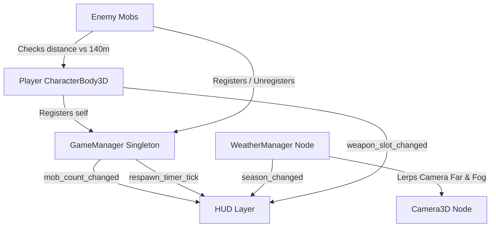

# 🎮 RockionSurvival - Godot 4 Open World Demo Developer Guide

Welcome to the **RockionSurvival** developer documentation! This file serves as a complete structural overview, architecture breakdown, and step-by-step tutorial on how to understand, edit, and expand this 3D open-world Godot 4 engine project manually.

---

## 📌 1. Project Overview & Key Features

**RockionSurvival** is a 3D open-world action-survival demo built with **Godot Engine 4.7+ (Forward+ renderer / Jolt 3D Physics)**.

### Core Gameplay Mechanics:
- **Massive $1400\text{m} \times 1400\text{m}$ Procedural Alpine Terrain**: $650\text{m}$ tall smooth rounded mountain peaks with dynamic height-based vertex normals and custom materials.
- **4 Switchable Weapon System** (Slot Hotbar & Scroll Wheel):
  1. 🗡️ **Sword** (`Slot 1`): Melee slash arc in front of player.
  2. 🏹 **Bow** (`Slot 2`): Reddish light-emitting arrow ($95.0\text{m/s}$) with realistic ballistic gravity arc ($15.0\text{m/s}^2$).
  3. 🔥 **Staff** (`Slot 3`): Heavy explosive Box Fireball with fast ballistic drop curve ($25.0\text{m/s}^2$) triggering an $8.5\text{m}$ AOE ground blast with mid-air shrinking ember particles and light emission (`OmniLight3D`).
  4. 🔨 **Hammer** (`Slot 4`): Heavy ground slam shockwave creating an expanding $6.5\text{m}$ radius ring AOE.
  5. 🪓 **Hatchet** (`Slot 6`): Poly 3D hatchet prop model with reddish light emission, ballistic drop trajectory, and sharp non-explosive impact spark particle burst on collision.
  6. 🏹 **Crossbow** (`Slot 7`): Rapid continuous auto-fire bolt stream ($0.18\text{s}$ interval / $330\text{ RPM}$) while holding Left Click, featuring 3D crosshair raycast targeting and amber light emission (`OmniLight3D`).
  7. ⚡ **Wand** (`Slot 8`): Instant 3D crackling Zigzag Lightning Bolt composed of 7 connected jittering electric cyan segments stretching directly from player to target, unaffected by gravity.
- **Dynamic Seasons & 4-Phase Day/Night Cycle**:
  - **4 Seasons** (`Key T`): Spring 🌸, Summer ☀️, Autumn 🍁, Winter ❄️.
  - **Time of Day** (`Key Y`): Sunrise 🌅, Noon ☀️, Dusk 🌇, Night 🌙.
  - Rotating solar light (`DirectionalLight3D`), time-of-day colored depth fog, and automatic Night render distance reduction ($320\text{m}$).
- **Super Mobility**:
  - `Key E`: Toggle **3X Fly Mode** ($72.0\text{m/s}$ flight speed with 6-DOF camera controls).
  - `Key Q`: **Super High Jump** ($32.0\text{m/s}$ launch).
  - Snappy realistic gravity ($32.0\text{m/s}^2$ + $1.6\times$ fall multiplier).
- **Server Mob Management**:
  - Max mob cap = **16 mobs**, 20s respawn timer.
  - Minecraft-style simulation despawner ($140.0\text{m}$ radius around player).
  - `Key R`: Unlimited manual mob spawner at current position for testing.

---

## 📁 2. File & Directory Structure

```text
RockionSurvival/
├── project.godot                     # Godot 4 engine configuration & Input Map settings
├── project.md                        # Developer tutorial & architecture guide (This file!)
├── icon.svg                          # Game icon
├── scenes/                           # 3D Node Scenes (.tscn)
│   ├── main.tscn                     # Main World scene combining all nodes
│   ├── player.tscn                   # Player CharacterBody3D scene with CameraRig & HeldArrow
│   ├── hud.tscn                      # CanvasLayer HUD (Minecraft Hotbar, FPS, Controls, Seasons)
│   ├── enemy_static.tscn             # Guard post mob variant scene
│   ├── enemy_wander.tscn             # Wandering mob variant scene
│   ├── enemy_chase.tscn              # Chasing mob variant scene
│   └── weapons/                      # Dedicated weapon scene subdirectories
│       ├── sword/sword_attack.tscn   # Sword slash arc scene
│       ├── bow/arrow_projectile.tscn # Bow arrow projectile scene
│       ├── spear/spear_attack.tscn   # Spear 4.5m forward box thrust scene
│       ├── hammer/hammer_slam.tscn   # Hammer expanding shockwave ring scene
│       ├── dagger/dagger_attack.tscn # Dagger rapid stab scene
│       ├── axe/thrown_axe.tscn       # Right-click / Slot 6 thrown axe scene
│       ├── crossbow/crossbow_bolt.tscn # Crossbow bolt projectile scene
│       ├── wand/wand_attack.tscn     # Wand magic wave scene
│       └── slash/slash_attack.tscn   # Melee slash attack scene
└── scripts/                          # GDScript Logic Files (.gd)
    ├── game_manager.gd               # Autoload Singleton (Server mob cap & global state)
    ├── player.gd                     # Player movement, fly mode, weapon switching, FPS bow aim
    ├── camera_rig.gd                 # SpringArm3D camera orbit & mouse control
    ├── terrain.gd                    # Procedural 1400m x 1400m heightmap terrain generator
    ├── weather_manager.gd            # Seasons (Key T), Day/Night loop, Key Y time advance, fog
    ├── spawner.gd                    # Initial 8 mob spawner & 20s respawn manager
    ├── ui/
    │   └── hud.gd                    # HUD UI signals, hotbar slot highlighting, FPS monitor
    ├── enemies/
    │   ├── enemy_base.gd             # Base mob script (random traits, damage, 140m simulation despawn)
    │   ├── enemy_static.gd           # Static guard mob behavior
    │   ├── enemy_wander.gd           # Wandering waypoint mob behavior
    │   └── enemy_chase.gd            # Player tracking chase mob behavior
    └── weapons/                      # Dedicated weapon script subdirectories
        ├── sword/sword_attack.gd     # Sword slash animation & collision script
        ├── bow/arrow_projectile.gd   # Charged arrow projectile script
        ├── spear/spear_attack.gd     # Spear forward box sweep script
        ├── hammer/hammer_slam.gd     # Hammer shockwave expansion script
        ├── dagger/dagger_attack.gd   # Dagger rapid stab script
        ├── axe/thrown_axe.gd         # Thrown axe projectile script
        ├── crossbow/crossbow_bolt.gd # Crossbow bolt projectile script
        ├── wand/wand_attack.gd       # Wand magic wave script
        └── slash/slash_attack.gd     # Melee slash attack script
```

---

## 🏗️ 3. Architecture & Signal Flow



---

## 🛠️ 4. Developer Manual: How to Modify & Extend the Game

### Tutorial 1: How to Add a New 5th Weapon (e.g. Dagger / Staff)
1. **Create the Script**:
   - Create `res://scripts/weapons/dagger/dagger_attack.gd`.
   - Extend `Area3D`. Connect `body_entered` to call `body.take_damage(1)`.
2. **Create the Scene**:
   - Create `res://scenes/weapons/dagger/dagger_attack.tscn`.
   - Add `CollisionShape3D` and `MeshInstance3D` (using `CylinderMesh` or `BoxMesh`).
   - Attach `dagger_attack.gd` to the root `Area3D`.
3. **Update Player Script** (`res://scripts/player.gd`):
   - Add entry to `enum WeaponType { SWORD = 0, BOW = 1, SPEAR = 2, HAMMER = 3, DAGGER = 4 }`.
   - Load the scene in `_ready()`: `dagger_scene = load("res://scenes/weapons/dagger/dagger_attack.tscn")`.
   - Add hotkey (Key `5`) in `_unhandled_input()` and add a slot in `hud.tscn`.

### Tutorial 2: How to Add a New Weather / Season Tint
1. Open `res://scripts/weather_manager.gd`.
2. Add your season to `enum Season { SPRING, SUMMER, AUTUMN, WINTER, VOLCANIC }`.
3. In `_get_season_tint()`, add a return color:
   ```gdscript
   Season.VOLCANIC: return Color(1.5, 0.5, 0.2) # Crimson lava tint
   ```
4. Press **Key T** in-game to cycle to your new season!

### Tutorial 3: How to Adjust Terrain Mountain Height or Spread
1. Open `res://scripts/terrain.gd`.
2. Modify the noise amplitude or exponent in `_generate_terrain()`:
   ```gdscript
   # Adjust peak height (e.g. 800.0m) or smoothness exponent (e.g. 2.5)
   var height: float = pow(n_elev * 0.5 + 0.5, 2.2) * 650.0
   ```
3. Save and run (`F5`) to instantly see the updated mountain geography!

---

## 🎮 5. Default In-Game Controls & Shortcuts

| Input | Action |
| :--- | :--- |
| **W / A / S / D** | Move Character |
| **Mouse Motion** | Orbit 3D Camera |
| **Spacebar** | Standard Jump / Fly Ascend |
| **Key Q** | Super High Jump ($32.0\text{m/s}$ launch) |
| **Key E** | Toggle 3X Fly Mode ON / OFF ($72.0\text{m/s}$) |
| **Keys 1, 2, 3, 4** | Select Weapon Slot (1: Sword, 2: Bow, 3: Spear, 4: Hammer) |
| **Mouse Scroll Wheel** | Scroll through Hotbar Weapon Slots |
| **Left Click (Click)** | Fire Active Weapon immediately (Sword, Bow, Staff, Hammer, Dagger, Hatchet, Wand) |
| **Left Click (Hold)** | **Crossbow Auto-Fire**: Continuously auto-fires bolts at $0.18\text{s}$ interval ($330\text{ RPM}$) |
| **Right Click** | Toggle FPS Aim Mode (zooms to first-person view, hides body, aligns crosshair) |
| **Key T** | Cycle Seasons (Spring $\rightarrow$ Summer $\rightarrow$ Autumn $\rightarrow$ Winter) |
| **Key Y** | Advance Time of Day (Sunrise $\rightarrow$ Noon $\rightarrow$ Dusk $\rightarrow$ Night) |
| **Key R** | Spawn Random-Trait Mob at Player Position (Unlimited for testing) |
| **ESC** | Toggle Mouse Cursor Capture / Free Cursor |

---

*Enjoy developing in Godot 4! Happy Coding!* 🚀
